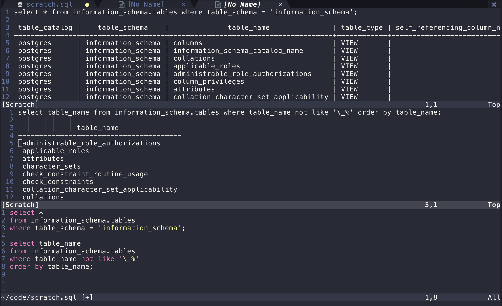

# Neovim/nvim plugin to execute PostgreSQL queries. Written in Lua

This is a simple plugin to execute SQL query from inside `nvim`.

The plugin executes query with `psql` command, opens a split buffer in nvim and shows results there.



Default shorcuts:
- Execute line under cursor (normal mode) `<leader>-e`
- Execute selection (visual mode) `<leader>-e`
- Execute current paragraph (normal mode) `<leader>-r`
- Close last result buffer `<leader>-w`
- Close all result buffers `<leader>-W`

# Installation

First of all, you will need to have PostgreSQL installed and `psql` command in the `$PATH`.

## Using NeoVim's native package system

```
Plug 'mzarnitsa/psql'
```

## Using git
Clone this repo into your Neovim package folder:
```
mkdir -p ~/.config/nvim/pack/packages/start/
git clone https://github.com/mzarnitsa/psql.git ~/.config/nvim/pack/packages/start/psql
```

After that add configuration to your `init.lua` file as shown below.

# Configuration

Minimal. Include the following into `~/.config/nvim/init.lua` file

```
require('psql').setup({
  database_name = 'postgres'
})
```

Using `init.vim`

```
lua << EOF
  require('psql').setup({
    database_name = 'postgres'
  })
EOF
```

All configuration parameters

```
require('psql').setup({
  database_name       = 'postgres'
  execute_line        = '<leader>e',
  execute_selection   = '<leader>e',
  execute_paragraph   = '<leader>r',

  close_latest_result = '<leader>w',
  close_all_results   = '<leader>W',
})
```
